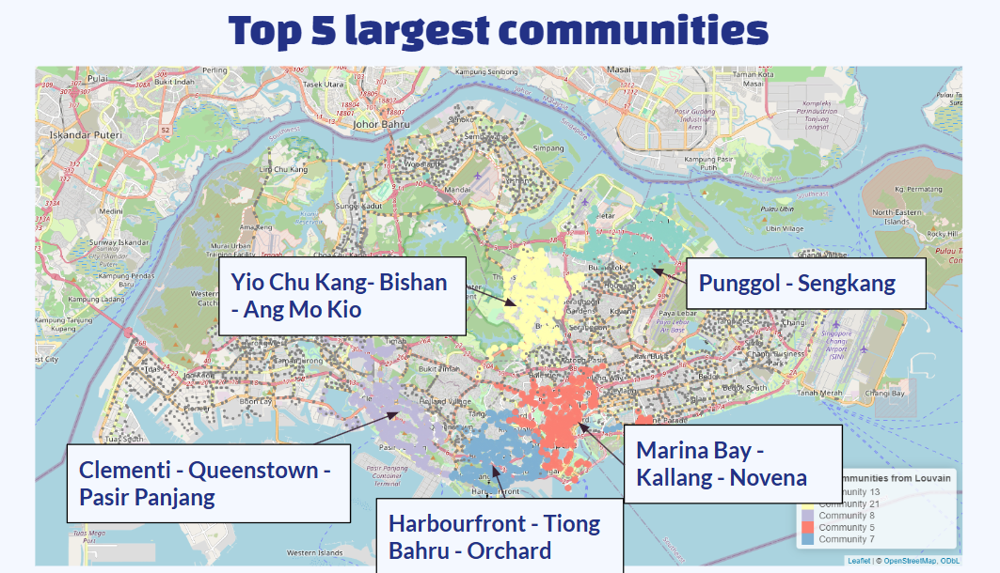

# Web-Analytics-of-bus-system-in-singapore

Singapore’s 60th Birthday Celebration Planning
As Singapore celebrates its 60th birthday, the organizing committee aims to host a series of decentralized activities leading up to the grand National Day Parade. 
The goals are to 
    1. ensure that these activities are accessible to the public.
    2. distribute event locations equitably across Singapore.

# Data Cleaning and preprocessing
Checked no null values and no duplicates.
Overall: 25,655 tuples - Combination of Bus Route and Bus Stops
We created pairs of consecutive bus stops and convert data pairs into a directed graph

 

# Illustration of top 5 largest communities for 4 different community detection methods
 

# Choosing the highest modularity a.k.a louvain's method

 

# Focus on louvain's method for community detection

# Creating composite centrality matrix to find the key bus stops to act as dispersion point to disperse the crowds
 

# Zoom in 
 

# Insights
Most bus stops mentioned within each community are within walking distance

These bus stops act as hubs, offering alternative routes to destinations and efficiently dispersing crowds.

Suitable buildings and open spaces nearby can accommodate large-scale events 

Top Nodes from Community 5 (Marina Bay-Kallang-Novena) and 13 (Punggol-Sengkang) have  higher closeness and eigenvector centrality
Facilitate faster crowd dispersion compared to top nodes in other communities
Well-suited to accommodate larger events

# Future Work
1. Expand the number of communities
2. Prediction of movement patterns of crowd a.k.a Historical data on traffic flow on event days
3. Other transportation networks e.g. mrt networks and cabs.
